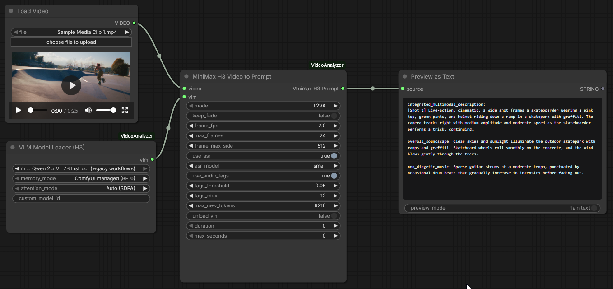

# ComfyUI-VideoAnalyzer

ComfyUI nodes that turn a video into a **MiniMax H3** video-generation prompt
(`T2VA` / `I2VA` / `FL2VA` / `L2VA`) or an **LTX-2.5** natural-language prompt,
by analyzing it with a vision-language model.

> **Key code source:** this pack is a port of
> [knishika62/video-analyzer](https://github.com/knishika62/video-analyzer)
> (`h3_video2prompt.py` + `h3_video2prompt_frames.py`) — the two-pass analysis
> pipeline, fade detection, keyframe extraction, ASR/audio-tag inputs, the H3/LTX
> prompt guides (`md/`) and the rewrite validation all originate from that
> repository. The H3 prompt spec itself comes from
> [MiniMax-AI/MiniMax-H3](https://github.com/MiniMax-AI/MiniMax-H3).



**Fully self-contained**: the VLM runs inside ComfyUI via
[ComfyUI_VLM_nodes](https://github.com/gokayfem/ComfyUI_VLM_nodes) — no
llama-server / LM Studio / API keys. The model auto-downloads from HuggingFace
on first execution into `ComfyUI/models/LLavacheckpoints/` and its VRAM
residency is managed by ComfyUI's model manager (smart loading/offloading).

## Nodes

> **Requires the [ComfyUI_VLM_nodes](https://github.com/gokayfem/ComfyUI_VLM_nodes)
> pack** (see Setup) — both of our nodes call its in-process VLM machinery, and
> its **View Text (Streaming)** node is used for display in the sample workflow.

| Node | Inputs | Outputs |
|------|--------|---------|
| **VLM Model Loader (H3)** | model picker, custom_model_id, memory_mode, attention_mode | `VLM_MODEL` |
| **MiniMax H3 Video to Prompt** | `video` (VIDEO), `vlm` (VLM_MODEL), `mode`, `duration`, + advanced options | `STRING` ("Minimax H3 Prompt") |

Display the result with the **View Text (Streaming)** node from ComfyUI_VLM_nodes
(`VLM Nodes/Text` category) — it also shows tokens live while they generate.
For tight-VRAM workflows the analyzer has an `unload_vlm` option that releases
the model after each run (it reloads automatically on the next).

Standard nodes are reused wherever possible: video input comes from the core
**Load Video** node (or any `VIDEO` source, e.g. Wan output), the VLM loader is
built on ComfyUI_VLM_nodes' `ModernVLMPredictor` (transformers, ComfyUI-managed
VRAM), and audio/frames are processed with system `ffmpeg`/`ffprobe`.

## Model

Default: `Qwen 2.5 VL 7B Instruct` (BF16, ~16 GB VRAM). Smaller/faster picks from
the loader's dropdown (e.g. `Qwen 3 VL 4B Instruct`, `Qwen 3 VL 2B Instruct`,
`SmolVLM2 2.2B Video`) auto-download the same way; a `Custom Hugging Face model`
field accepts any image/video-to-text repo id. For cards under 16 GB VRAM use
the 4-bit NF4 memory mode or a smaller catalog model.

## Platform support

| Platform | Notes |
|----------|-------|
| Windows  | Primary dev/test platform (RTX 5090, CUDA). `ffmpeg` in PATH required. |
| Linux    | Same code paths (pure `pathlib`, `subprocess ffmpeg`, CPU faster-whisper). CUDA or CPU. |
| macOS    | Apple Silicon: ComfyUI_VLM_nodes selects Metal; use `ComfyUI managed (BF16)` memory mode and `Auto (SDPA)` attention (the defaults). ASR (faster-whisper) and PANNs run on CPU. |

All models download automatically on first use — no manual model placement:
the VLM into `ComfyUI/models/LLavacheckpoints/`, faster-whisper and PANNs
weights into their standard cache locations.

## How it works (two passes, one loaded model)

1. **Prep (ffmpeg)**: fade-in/out (black) detection trims the clip to its
   content range, then up to `max_frames` jpg frames are sampled at `frame_fps`
   (bounded by `frame_max_side`), and keyframes (`first`/`last`, original
   resolution) are extracted for the I2VA/FL2VA/L2VA modes.
2. **Audio**: if the video has audio, it is transcribed with faster-whisper
   (`use_asr`) and tagged with PANNs/AudioSet (`use_audio_tags`); transcript and
   tags feed both passes.
3. **Pass 1 - visual analysis**: all sampled frames go to the VLM in one call
   through the model's native video pathway (timestamps included), returning a
   structured shot-by-shot JSON (saved as `analysis.json`).
4. **Pass 2 - prompt rewrite**: analysis JSON + the full MiniMax H3 prompt guide
   (`md/minimax-h3-prompt-guide-base.md`) → the three H3 core fields
   (`integrated_multimodal_description` / `overall_soundscape` /
   `non_diegetic_music`), with output validation, field-label repair and a
   corrective retry. Keyframe modes get the fixed image-alignment line added by
   code. LTX mode uses the LTX guide and outputs one natural-language prompt.

Intermediate artifacts (`analysis.json`, `prompt.txt`, `frames/`,
`keyframes/first.jpg|last.jpg`, `transcript.txt`, `audio_tags.txt`, failure
dumps) are written to `<ComfyUI temp>/h3_video2prompt/` for inspection.

## Setup

```bat
:: 1) the VLM node pack (in-process model loading + auto-download)
git clone https://github.com/gokayfem/ComfyUI_VLM_nodes ComfyUI\custom_nodes\ComfyUI_VLM_nodes

:: 2) dependencies for both packs (portable ComfyUI; does not touch ComfyUI's torch)
python_embeded\python.exe -m pip install -r ComfyUI\custom_nodes\ComfyUI_VLM_nodes\requirements.txt
python_embeded\python.exe -m pip install -r ComfyUI\custom_nodes\ComfyUI-VideoAnalyzer\requirements.txt
```

Requires `ffmpeg`/`ffprobe` in PATH. First execution of the VLM loader
downloads the selected model (Qwen2.5-VL-7B ≈ 16 GB) — watch the console.

**Dependency safety:** both requirement sets install additively — they do not
upgrade or downgrade any ComfyUI core dependency (torch, numpy, transformers,
safetensors, av, ...). Verified with `pip check` against ComfyUI 0.36's own
`requirements.txt` plus a clean server boot with zero custom-node import
failures. Version bounds in both `requirements.txt` files reflect the tested
versions.

## Workflow

Load `workflows/h3_video2prompt_sample.json` in ComfyUI:
`Load Video -> MiniMax H3 Video to Prompt -> View Text (Streaming)`, with the
VLM Model Loader feeding the analyzer node.

## Tests

```bat
:: direct pipeline test over all sample videos (loads the VLM in-process)
python_embeded\python.exe ComfyUI\custom_nodes\ComfyUI-VideoAnalyzer\test\test_e2e.py
::    options: --videos 8,9  --mode FL2VA|I2VA|L2VA|LTX|T2VA  --model <catalog label>

:: comprehensive pre-release matrix (25 cases: modes, durations, sampling,
:: audio options, fade handling, synthetic no-audio/vertical/1s videos, negative cases)
python_embeded\python.exe ComfyUI\custom_nodes\ComfyUI-VideoAnalyzer\test\test_matrix.py
::    --quick for the first 12 cases

:: full-stack test through a running ComfyUI server (port 8188)
python_embeded\python.exe ComfyUI\custom_nodes\ComfyUI-VideoAnalyzer\test\test_workflow_api.py --clip 8 [--mode LTX]
```

Test paths can be overridden with `H3_TEST_VIDEOS` and `COMFYUI_ROOT` environment
variables for non-Windows machines.

Results (Adobe Premiere 26.0 sample media + 5 synthetic clips, RTX 5090,
in-process Qwen2.5-VL-7B, ComfyUI 0.36):

- **test_matrix: 25/25 PASS** — 7 mode cases (T2VA/I2VA/FL2VA/L2VA/LTX,
  single- and multi-shot), duration clamps/snap + 2 negative validation cases,
  frame_fps/max_frames/frame_max_side/max_seconds sampling checks, ASR/audio-tag
  toggles, tags_threshold/tags_max, keep_fade, fade-trim on a fade-in/out clip,
  silent video, vertical video, 1-second video, 720p video
- **test_e2e: 17/17 PASS** (T2VA over every sample clip)
- **full-stack `/prompt` API: PASS** — T2VA and LTX, including `unload_vlm=true`
  reload cycles
- **auto-download verified for all three model types**: VLM (fresh catalog model
  downloaded into `ComfyUI/models/LLavacheckpoints/`), faster-whisper (tiny +
  small re-downloaded after cache deletion), PANNs weights (re-downloaded after
  deletion)

## License and credits

This pack is licensed under the **MIT License** (see
[LICENSE](LICENSE)) for its own code: the ComfyUI nodes, the Windows/ComfyUI
pipeline port, robustness handling, workflows, and tests.

- Pipeline and prompt guides: based on
  [knishika62/video-analyzer](https://github.com/knishika62/video-analyzer)
  by Kazuhisa Nishikawa — the reference implementation this port derives from,
  licensed under the **MIT License** (added upstream in September 2026 at this
  port's request; the author also granted permission via email). The port
  contains substantial modifications (Windows/ComfyUI integration, in-process
  VLM loading, robustness handling).
- H3 prompt spec and the bundled prompt guides (`md/`): derived from the
  [MiniMax-AI/MiniMax-H3](https://github.com/MiniMax-AI/MiniMax-H3) project
  documentation (also without a detected SPDX license; included with
  attribution as technical documentation).
- In-process VLM loading: [ComfyUI_VLM_nodes](https://github.com/gokayfem/ComfyUI_VLM_nodes)
  by Gökay Aydoğan.
